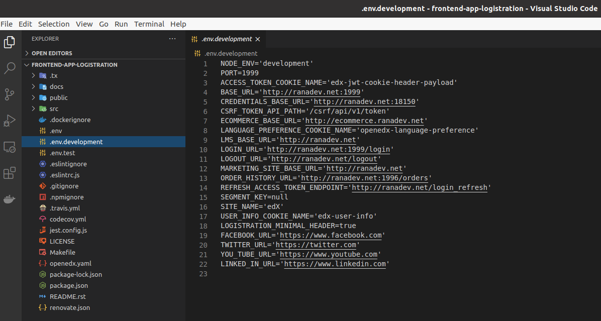
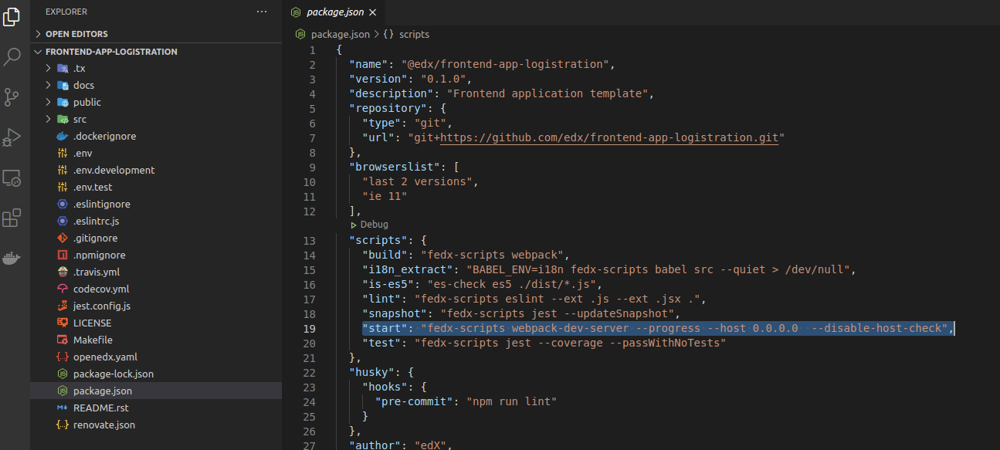

## frontend-app-logistration
This is a micro-frontend application responsible for the login, registration and password reset functionality. End modified for Tutor Open edX.
This is an example plugin for to implement a micro-frontend application to Tutor Open edX. This example little bit different than this repository https://github.com/overhangio/tutor-gradebook but it works. Please test it before using in production !

#### Cloning and configuring Frontend-app-logistration

Step 1: Fork this repository from edx https://github.com/edx/frontend-app-logistration to your GitHub account

Step 2: Clone the repo to your local PC or server, than make a new branch for your customizations.

`$ git branch <YourBranchName>`

`$ git checkout <YourBranchName> `

Step 3: Edit .ENV.development, and packege.json file like this examples below. Than push back to your GitHub account.

Step 3: Make your custom plugin, or clone and modify this plugin with your values (Don't forget to edit 'plugin.py' and 'Dockerfile' and the other patches )

### Installation:

If using virtualenv: (optional)

`$ python3 -m venv ~/tutor`

`$ source ~/tutor/bin/activate`

 Cloning and installing plugin

`$ https://github.com/murat-polat/tutor-applogistration `  (replace your plugin repo)

`$ pip3 install -e tutor-applogistration`         (your plugin name)

`$ tutor plugins list`

`$ tutor plugins enable applogistration`

`$ tutor config save`

Building new Docker services for Tutor

`$ tutor images build applogistration`

`$ tutor local quickstart `

visit http://yourdomain.com:1999/login.

### Django Admin site redirection(login and register pages)
By default Open edX login page is " LMS_HOST/login ". But on Logistration  is " LMS_HOST:1999/login ". So we must redirect **login** and **register** pages to the new login pages . There are different ways available for redirections. But the most easiest way, to do that on the Django Admin side.

To add new site go to the http://yourdomain.com/admin/sites/site/ and add new site for Logistration service: (LMS_HOST:1999)

After adding new page go to the http://yourdomain.com/admin/redirects/redirect/ and add new redirection for **login** page
